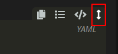

The BlendOS v4 alpha is now out! Here's how you can install and try it out.

<!--more-->
{}
Info about v4

I'm not going to go over the release details. For those, go to the [release blog post](https://blog.blendos.co/blendos-v4-alpha).
{}


# Installing v4

BlendOS v4 is a lot more declarative than v3. The current beta must be installed on top of Arch.
## What you'll need


Do not install this on top of BlendOS v3!
There is no upgrade procedure <i>yet</i>, this will ruin your v3 install if you try to update from it.



- An Arch Linux VM (or real PC, if you dare) using `mkinitcpio` for the kernel image, **GRUB** as the bootloader, and no disk encryption[^1]. 
- An internet connection
- Time
- Basic YAML knowledge

[^1]: You can use encryption by moving the `akshara` hook after the `encrypt` one in your `mkinitcpio.conf`, but this has not been tested, and is not officially supported.

## Steps

I'm assuming your Arch Linux system is already up and running. If it isn't, there's plenty of guides, and you can just use <code>archinstall</code>.

### Add the `breakfast` repo

At the end of your `pacman.conf` add the following lines:

```ini
 [breakfast]
 SigLevel = Never
 Server = https://pkg-repo.blendos.co
```
\* Yes, I am aware this has a `SigLevel` of never, this is very insecure. I'm assuming this is just a testing thing and will be fixed.

If you'd like to browse our small repo, [feel free to do so](https://pkg-repo.blendos.co).

### Create your system config

Create a file in `/` named `system.yaml`

Avalible tracks on the [standard repo](https://github.com/blend-os/tracks):

- `plasma`
- `gnome`
- `xfce`
- `mate`
- `lxqt`
- `blendos-base` \* Kinda bloated for a base, if you want something stripped down, [see below](#configuration-customization). This track allows for custom desktops and more.

Support for an <code>aur_packages:</code> option is coming soon.

This is YAML so indentation is important. All indents are 2 *spaces* (no tabs).

{}
Tip

Some codeblocks may require expanding.


{}


```yaml
 # /system.yaml

 repo: 'https://pkg-repo.blendos.co/'

 impl: 'https://github.com/blend-os/tracks/raw/main' # or an alternate track repo

 track: 'plasma' # or 'xfce' or 'mate'

                 # GNOME isn't recommended
                 # at the moment as it is
                 # known to be be buggy.

 packages: 
     - 'firefox' # stuff to install using pacman
 #   - 'nvidia-dkms' if you're using an NVIDIA GPU
```

You can add repos and things to this file, as documented [here](https://github.com/blend-os/tracks/blob/main/README.md#example-gnome-systemyaml-with-caddy):

```yaml
repo: 'https://pkg-repo.blendos.co/'

impl: 'https://github.com/blend-os/tracks/raw/main'

track: 'gnome'

packages:
    - 'micro'
    - 'caddy'

services:
    - 'caddy' # what services to start

package-repos:
    - name: 'chaotic-aur' # the name as it would appear in pacman.conf
      repo-url: 'https://cdn-mirror.chaotic.cx/$repo/$arch' # the Server
```

## Configuration customization

Scroll to the next section if you do not wish to customize your config further.

### Track repo


Want to add to this list?
Just make a comment! I'll look at your repo if you comment it.



Currently there are also alternate track repos:

[T2Linux track repo](https://github.com/NoaHimesaka1873/blendos-tracks-t2/):

For T2Linux users.

Avalible tracks:

- All tracks from the standard repo. modified for T2Linux
- `blendos-base` renamed to `blendos-base-t2`

```yaml
impl: 'https://github.com/NoaHimesaka1873/blendos-tracks-t2/raw/main'
```

[ico277 stripped base track repo](https://github.com/ico277/blendos-tracks):

This repo modifies `blendos-base` to be more stripped down, and creates a `blendos-dekstop` track.

Avalible tracks:

- All standard tracks are unmodified, except for `blendos-base`
- `blendos-desktop` added

```yaml
impl: 'https://github.com/ico277/blendos-tracks/raw/main'

track: 'blendos-base' # one of two tracks that differ from the standard repo
```
\* you can also use ico277's `blendos-desktop` track with this repo, which adds a very minimal (like just pipewire and xorg) desktop setup to `blendos-base`.

Always run <code>sudo akshara update</code> after editing your <code>system.yaml</code>.


## Steps (cont.d)

### Installing `akshara`

Run `sudo pacman -Sy akshara`.

### Adding `akshara` into `mkinitcpio`

Edit `/etc/mkinitcpio` and add `akshara` after the `base udev` bit in the `HOOKS` part of the file.

Run `sudo mkinitcpio -P; sudo akshara update`.

Reboot your system.


BlendOS v4 is now installed!
To update your Arch packages, just run <code>sudo akshara update</code>.


## Post-Install

### Adding repos


Add a line to the end of `system.yaml` like so (using the [`chaotic-aur`](https://aur.chaotic.cx) as an example):

```yaml
package-repos:
    - name: 'chaotic-aur' # repo name as it would appear in pacman.conf
      repo-url: 'https://cdn-mirror.chaotic.cx/$repo/$arch' # Repo URL as it would appear in pacman.conf
```

(the [Chaotic AUR's](https://aur.chaotic.cx) package list can be found [here](https://archlinux.pkgs.org/rolling/chaotic-aur-x86_64/), and packages can be manually downloaded from [here](https://builds.garudalinux.org/repos/chaotic-aur/x86_64/))

If you add repos, run `sudo akshara update` and reboot afterwards.

### Adding AUR packages

We're hoping to make this easier with this [merge request](https://git.blendos.co/blendOS/system-tools/akshara/-/merge_requests/1).

If you know what you're doing, you can attempt to install AUR packages manually by adding stuff to the `commands:` section of `system.yaml`.

## Reference

### `system.yaml`
{}
Tip

Some codeblocks may require expanding.


{}

`system.yaml` structure (preserve all single quotes):

```yaml
repo: 'https://pkg-repo.blendos.co' # Do not change this.

# the track repo
impl: 'https://github.com/USER/REPO/raw/BRANCH' # For gitlab, https://GITLAB_SERVER/USER/REPO/-/raw/BRANCH/

track: 'plasma' # The track you want

packages:       # Packages to install using pacman
  - 'package_1'
  - 'package_2'

services:       # Enable these systemd services
  - 'service_1'

package_repos:
  - name: 'REPO_NAME' # as it appears in pacman.conf
    repo-url: 'REPO_URL' # the Server variable in pacman.conf for this repo

commands:       # List of commands to run at system build, will execute with root permissions, more file-related stuff like git is tricky
  - 'echo command_1'
  - 'echo command_2'

```


### `akshara`

#### Update system (new arch packages, edited config)

```bash
sudo akshara update
```
\* You will need to reboot after this.


#### Help menu

```bash
akshara help
```

#### Version

```bash
akshara version
```


------

[](/about/#generative-ai-chatgpt)

-------

For copyright, please also see the [Licensing page](/about#license-exemptions).
