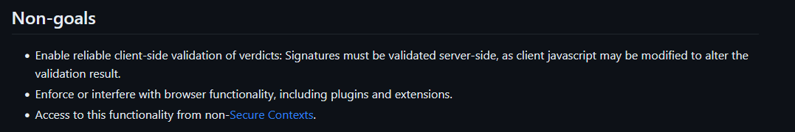

We are currently seeing a lot of rules and practices that are putting a shelf life on the free Internet.

<!--more-->
<!-- The Threat of Web Environment Integrity: A Doomsday Clock for the Free Internet-->

-----

# Intro: An explainer

This is the Bulletin of The Atomic Scientists' Doomsday Clock:

This clock represents the "time" to humanity's own demise. If you're reading this in the future and the clock has struck midnight, God help you.

[Currently](https://thebulletin.org/doomsday-clock/current-time/) we are at 90 seconds to midnight. The war in Ukraine, combined with increased climate and nuclear fears, caused this rating.

This might seem a little weird, just follow with me. I feel there are several things in the works to create the free Internet's own doomsday clock. Let's go through them, shall we?

## Doomsday Devices

### Web Environment Integrity

[Web Environment Integrity](https://en.wikipedia.org/wiki/Web_Environment_Integrity) (WEI) is DRM for your browser created by [some Google engineers](https://github.com/RupertBenWiser/Web-Environment-Integrity/blob/main/explainer.md#authors) who were smoking *something*[^1] when they came up with this shit.

Why is this bad? [Issue #28](https://github.com/RupertBenWiser/Web-Environment-Integrity/issues/28) and plenty of articles explain why. Defective By Design, part of the [FSF](https://fsf.org), wrote a great [article](https://www.defectivebydesign.org/blog/web_environment_integrity_is_an_all_out_attack_on_free_internet) on this. The EFF wrote a [more detailed explanation](https://www.eff.org/deeplinks/2023/08/your-computer-should-say-what-you-tell-it-say-1) as well.

Here's the [explainer document](https://github.com/RupertBenWiser/Web-Environment-Integrity/blob/main/explainer.md) if you'd like to read this insanity.

I'm not going to go into detail as to why WEI is *bad*, as others have done a great job explaining that. However I will go over a few things quickly.

I highly doubt the [above extract](https://github.com/RupertBenWiser/Web-Environment-Integrity/blob/main/explainer.md#non-goals). Google's in this to destroy ad and tracker blocking once and for all (though from this it seems using a pihole/adguard home server *might* still work).

Here's some [example use cases](https://github.com/RupertBenWiser/Web-Environment-Integrity/blob/main/explainer.md#example-use-cases) from the explainer:

> - Detect social media manipulation and fake engagement.
> - Detect non-human traffic in advertising to improve user experience and access to web content
> - Detect phishing campaigns (e.g. webviews in malicious apps) 
> - Detect bulk hijacking attempts and bulk account creation.
> - Detect large scale cheating in web based games with fake clients
> - Detect compromised devices where user data would be at risk
> - Detect account takeover attempts by identifying password guessing
>
> *- WEI Explainer Authors*

Fake engagement won't go away, Cloudflare and Google's own Safe Browsing service exist, there are automated systems in place for bulk account creation, other anticheats exist, there are other ways to detect compromised devices and it's not hard to identify password guessing; you just need a bit of JS.


All the use cases are not valid, except for <i>maybe</i> the 6th one.


------

The cover image was AI-generated, but that still makes my text content 100% human. 

You can find the image [here](https://playgroundai.com/post/clkegqaqh00f4s601ucltkj5a). It was created by [Charra l](https://playgroundai.com/profile/cljvgleqe0p78s601elle8bb6).

[^1]: On a side note, I'd like to have that something.